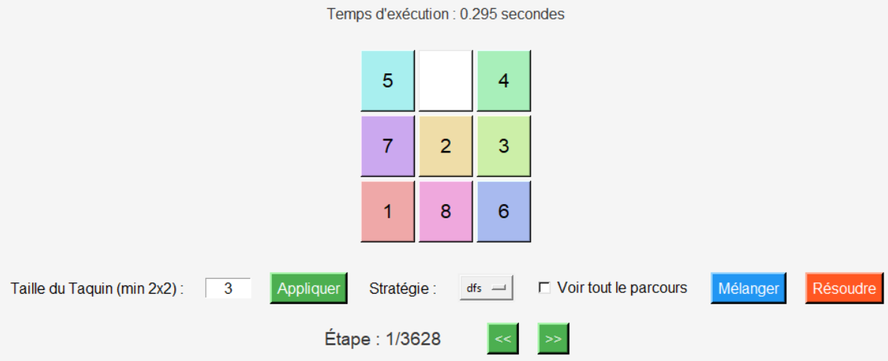
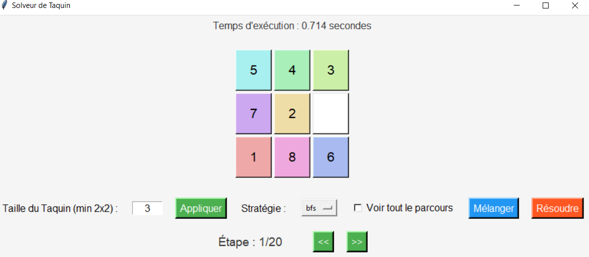
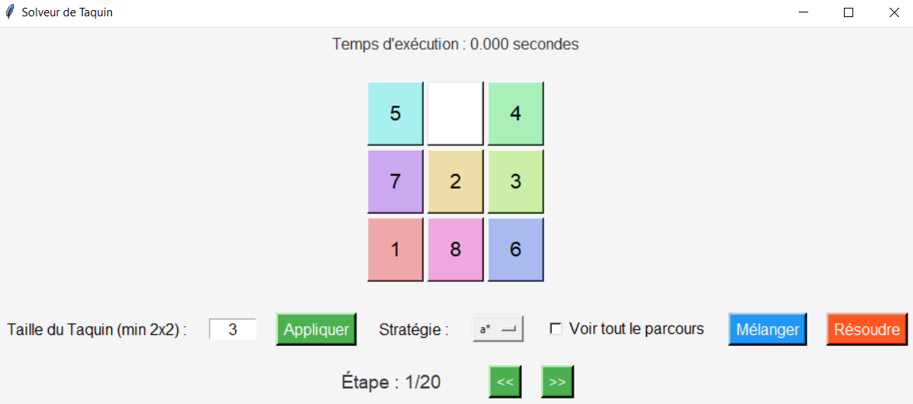
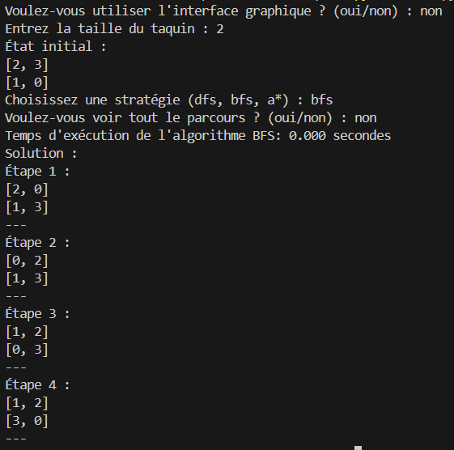
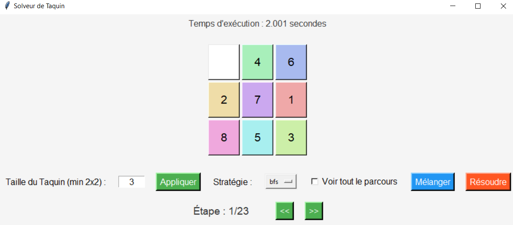

# Solveur de Taquin

Ce projet implémente un solveur pour le jeu du Taquin, un puzzle consistant à déplacer des cases sur une grille pour atteindre un état final. L'interface graphique est construite avec la bibliothèque **Tkinter**, et le solveur utilise plusieurs algorithmes de recherche pour résoudre le puzzle : **DFS**, **BFS** et **A\***.

---

## Fonctionnalités

- **Interface graphique** intuitive avec Tkinter pour interagir avec le puzzle.
- **Algorithmes de résolution** : DFS (Depth-First Search), BFS (Breadth-First Search), A*.
- **Suivi du parcours** de résolution : possibilité de visualiser l'ensemble des étapes intermédiaires ou uniquement la solution finale.
- **Personnalisation** de la taille du Taquin.
- **Affichage dynamique** des étapes avec mise à jour en temps réel de l'interface.

---

## Bibliothèques nécessaires

Ce projet utilise la bibliothèque Tkinter pour l'interface graphique et la bibliothèque `colorsys` pour générer des couleurs.

---

## Exécutez le fichier principal :

python main.py

Cela vous demandera ensuite de choisir d'utiliser l'interface graphique ou non pour la résolution du taquin.

---

## Fonctionnement 

### Interface principale (GUI)

L'interface se compose de plusieurs éléments :

#### Grille de Taquin
Une matrice de boutons représentant le puzzle. Vous pouvez mélanger les cases pour créer un état initial aléatoire.

#### Contrôles
- **Taille du Taquin** : Permet de changer la taille du puzzle (minimum 2x2).
- **Choix de l'algorithme** : Sélectionnez l'algorithme de recherche pour résoudre le puzzle : `DFS`, `BFS` ou `A*`.
- **Mode Parcours** : Cochez cette option pour afficher toutes les étapes de la résolution, sinon seule la solution finale sera montrée.
- **Mélanger** : Mélange les cases du Taquin pour créer un nouvel état initial.
- **Résoudre** : Lance la résolution du puzzle avec l'algorithme sélectionné.

#### Navigation
- Utilisez les boutons `<<` et `>>` pour naviguer dans les étapes du parcours ou de la solution.
- L'état actuel est mis à jour à chaque étape.

### Version terminal

La version terminal suit une logique textuelle. Voici son fonctionnement :

#### Configuration
- **Saisissez la taille du puzzle.**
- **Un état initial sera créé aléatoirement.**

### Sélection de l'algorithme
- Choisissez parmi `DFS`, `BFS` ou `A*`.

### Mode Parcours
-  Vhoisir d'afficher toutes les étapes de la résolution ou seulement la solution.

### Affichage des résultats
- Le terminal affichera **chaque étape** (si demandée) ou **uniquement la solution finale**.
- Les performances (**temps d'exécution**, **nombre de nœuds explorés**) seront également affichées.

---

## Algorithmes

- **DFS (Depth-First Search)** : Une recherche en profondeur qui explore un chemin jusqu'à son extrémité avant de revenir en arrière.
- **BFS (Breadth-First Search)** : Une recherche en largeur qui explore tous les voisins d'un état avant de passer aux niveaux suivants.
- **A*** : Un algorithme de recherche informée qui utilise une heuristique pour guider la recherche vers la solution.

---

## Structure du projet

- **`main.py`** : Le fichier principal exécutant l'interface Tkinter et la logique de l'application.
- **`Taquin.py`** : Classe représentant le puzzle du Taquin, incluant les méthodes pour mélanger et résoudre le puzzle. Sert également de version terminal.
- **`Strategies.py`** : Contient les différentes stratégies de résolution (`DFS`, `BFS`, `A*`).
- **`InterfaceTaquin.py`** : Classe contenant l'interface graphique de l'application, y compris la gestion de la grille, des boutons et des contrôles.

---

## Exemple de comparatif des stratégies

#### Premier exemple :

Pour la stratégie DFS, on trouve en 0.295 secondes une solution en 3628 étapes et un parcours total en 5789 étapes.

Pour la stratégie BFS, on trouve en 0.753 secondes une solution en 20 étapes et un parcours total en 76525 étapes.

Pour la stratégie A*, on trouve en 0.000 secondes une solution en 20 étapes et un parcours total en 1244 étapes.

---
## Screenshots

